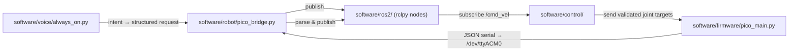

# Sipher Architecture — Layer Boundaries & Contracts

**Status:** Active baseline  
**Target stack:**

```
AI / Voice / Dashboard  -->  Robot Runtime  -->  ROS 2 Middleware  -->  Control Layer  -->  Pico 2 W Firmware  -->  Hardware
```

This document defines the strict separation of concerns for the Sipher quadruped robot software stack. Every layer below is a hard boundary — code in one layer must not reach past the next layer to touch hardware, firmware, or lower-level logic.

---

## 1. Layer Diagrams

### Full Stack


### Data Flow (happy path)



---

## 2. Layer Responsibilities

### Layer 1 — AI / Voice / Dashboard (`software/voice/`)

**Owned by:** `always_on.py` (and future dashboard modules)

**Responsible for:**
- Audio capture from USB mic (`plughw:CARD=Device,DEV:0`)
- Speech-to-text (faster-whisper tiny CPU, or Groq API)
- Text-to-speech (espeak)
- Intent extraction from transcribed text
- Emitting **structured action requests** (e.g. `REQUEST_MOTION(rotate)`, `REQUEST_STOP`, `REQUEST_SHUTDOWN`)

**Hard rules:**
- ❌ Must NOT directly write servo PWM values
- ❌ Must NOT bypass safety limits
- ❌ Must NOT directly access motor drivers or PCA9685
- ❌ Must NOT override emergency-stop logic
- ❌ Must NOT call `mpremote`, `subprocess`, or raw I2C writes
- ✅ May only emit structured requests to the Robot Runtime layer

**Interface to Layer 2:** Structured action requests (Python dataclass / JSON over local socket or ROS 2 topic).

---

### Layer 2 — Robot Runtime (`software/robot/`)

**Owned by:** `pico_bridge.py` (hardware bridge), state machine, command validator

**Responsible for:**
- **Single-owner access** to `/dev/ttyACM0` — the one and only process that opens the serial port
- Receiving structured requests from Layer 1
- Validating robot safety state before forwarding any command
- Publishing parsed sensor telemetry to ROS 2 topics (`/sensor/imu`, `/sensor/gps`, `/sensor/power`, `/sensor/scan`)
- Maintaining robot state (idle, moving, stopped, e-stop active)
- Coordinating emergency-stop (software + hardware)

**Hard rules:**
- ❌ Must NOT perform kinematic calculations (belongs to Layer 4)
- ❌ Must NOT publish raw sensor bytes — must parse and publish structured messages
- ✅ Owns the serial file descriptor exclusively
- ✅ Validates every incoming command against current robot state

**Interface to Layer 1:** Accepts structured requests, returns acknowledgment / rejection with reason.  
**Interface to Layer 3:** Publishes sensor topics, subscribes to command topics.  
**Interface to Layer 5:** Serial JSON transport to Pico 2 W.

---

### Layer 3 — ROS 2 Middleware (`software/ros2/`)

**Owned by:** `sipher_hardware` ROS 2 package (rclpy nodes)

**Responsible for:**
- ROS 2 node lifecycle (init, spin, shutdown)
- Publishing sensor messages:
  - `/imu/data` — `sensor_msgs/Imu` from MPU6050
  - `/gps/fix` — `sensor_msgs/NavSatFix` from NEO-6M
  - `/battery/status` — custom msg from INA219
  - `/scan` — `sensor_msgs/LaserScan` from VL53L0X (when driver ready)
- Subscribing to command topics:
  - `/cmd_vel` — `geometry_msgs/Twist` → translated to joint targets
- Parameter server for runtime configuration

**Hard rules:**
- ❌ Must NOT own the serial port (Layer 2 does)
- ❌ Must NOT perform inverse kinematics (Layer 4 does)
- ✅ Pure middleware — translate between ROS 2 msgs and internal representation

**Dependency:** ROS 2 Jazzy Jalisco on Ubuntu 24.04.4 LTS (`noble`). Required packages: `rclpy`, `std_msgs`, `geometry_msgs`, `sensor_msgs`, `robot_state_publisher`.

---

### Layer 4 — Control Layer (`software/control/`)

**Owned by:** gait generator, inverse kinematics, joint limit enforcer, emergency-stop logic

**Responsible for:**
- **Joint limits:** min/max angles per servo, rate-of-change limits
- **Inverse kinematics:** foot trajectory calculation from body velocity / rotation commands
- **Gait generation:** tripod, wave, trot patterns for flat and rough terrain
- **Posture stabilization:** use MPU6050 IMU data to adjust gait in real time
- **Obstacle clearance:** use VL53L0X range data to halt or redirect
- **Emergency-stop:** software E-Stop that neutralizes all servo PWM within 250 ms of lost heartbeat

**Hard rules:**
- ❌ Must NOT access hardware directly (I2C, SPI, UART — belongs to firmware)
- ❌ Must NOT own the serial port
- ✅ All joint angles must pass through limit validation before being sent to firmware
- ✅ Every gait step must be checked against current IMU posture

**Interface to Layer 5:** Validated joint angle targets (12 servos × 1 value each), sent via Layer 2's serial bridge.

---

### Layer 5 — Embedded Firmware (`software/firmware/`)

**Owned by:** MicroPython on Pico 2 W (RP2350)

**Files:**
- `main.py` — boot coordinator (boot logo → sleep → pico_main)
- `boot_logo.py` — ILI9341 boot animation from `anime.rgb565`
- `ili9341.py` — TFT SPI0 driver
- `pico_main.py` — sensor polling loop + JSON serial streaming

**Responsible for:**
- Real-time sensor polling (MPU6050, VL53L0X, INA219, GPS)
- PCA9685 PWM generation for 12 servos
- Serial JSON packet transport to/from Pi (`/dev/ttyACM0` USB-CDC)
- **Watchdog / heartbeat:** 250 ms timeout — if no keep-alive packet from Pi, auto-neutralize all servos (write PCA9685 to sleep mode)
- Display framebuffer updates (TFT) — must not block SPI bus for nRF24

**Hard rules:**
- ❌ Must NOT perform high-level gait decisions (Layer 4 does)
- ❌ Must NOT interpret voice commands (Layer 1 does)
- ✅ Must enforce watchdog timeout regardless of Pi state
- ✅ Must handle shared SPI0 bus carefully (TFT + nRF24)

**Interface to Layer 4:** Accepts validated joint targets, returns sensor telemetry as JSON lines.

---

### Layer 6 — Telemetry (`software/telemetry/`)

**Owned by:** `pi_logger.py` (or future ROS 2 subscriber node)

**Responsible for:**
- Consuming parsed sensor data from Layer 2 (not raw serial)
- Persisting logs to `/home/sipher/sipher.log`
- Optional: real-time dashboards, alerting on threshold breaches

**Hard rules:**
- ❌ Must NOT open `/dev/ttyACM0` directly — Layer 2 owns it
- ✅ Subscribes to ROS 2 sensor topics or reads from Layer 2's published data

---

## 3. Safety Rules (all layers)

1. **No direct motor access from AI/Voice:** Voice code must not write PWM, bypass limits, or touch motor drivers.
2. **Single serial owner:** Exactly one process (Layer 2's `pico_bridge.py`) may open `/dev/ttyACM0`.
3. **Watchdog on firmware:** Pico 2 W must neutralize servos within 250 ms of lost Pi heartbeat.
4. **Joint limits enforced in control layer:** Every angle must be validated before reaching firmware.
5. **Emergency-stop is orthogonal:** E-Stop must work even if ROS 2, voice, or control layer crash.

---

## 4. Migration Phases

Following: **Inspect → Map → Define Destination → Migrate → Validate → Commit**

### Phase 1: Serial Hardware Bridge (Runtime Layer)
- Build `software/robot/pico_bridge.py`
- Single-owner access to `/dev/ttyACM0`
- Emits clean parsed JSON telemetry, receives validated movement commands

### Phase 2: Control Layer & Safety Envelope
- Implement `software/control/joint_limits.py` (min/max angles, rate limits)
- Implement `software/control/emergency_stop.py` (software + hardware E-Stop)
- Implement firmware watchdog on Pico (250 ms timeout auto-neutralize)

### Phase 3: ROS 2 Integration
- Create `sipher_hardware` ROS 2 package
- Publish `/imu/data`, `/gps/fix`, `/battery/status`
- Subscribe to `/cmd_vel` (`geometry_msgs/Twist`)

### Phase 4: Decouple Voice & AI
- Refactor `software/voice/always_on.py` to publish high-level goals
- Route motion intents through Runtime validator
- Remove all `mpremote` and `subprocess` motor execution from voice code

---

## 5. Hardware Summary

| Bus | Devices | Addresses / Pins |
|---|---|---|
| I2C0 (100 kHz) | MPU6050, PCA9685, INA219, VL53L0X | 0x68, 0x40, 0x41, 0x29 — GP8/GP9 |
| UART0 (9600) | NEO-6M GPS | GP0 TX, GP1 RX |
| SPI0 (shared) | ILI9341 TFT + nRF24L01+ | CS GP17 / CSN GP20, SCK GP18, MOSI GP19, MISO GP16 |

**Power:** PCA9685 V+ 5-6V 3A servo rail via UBEC. Common star-GND at Pico. INA219 inline on VBAT.

**See:** `docs/hardware/pico-wiring.md` for full schematic.
