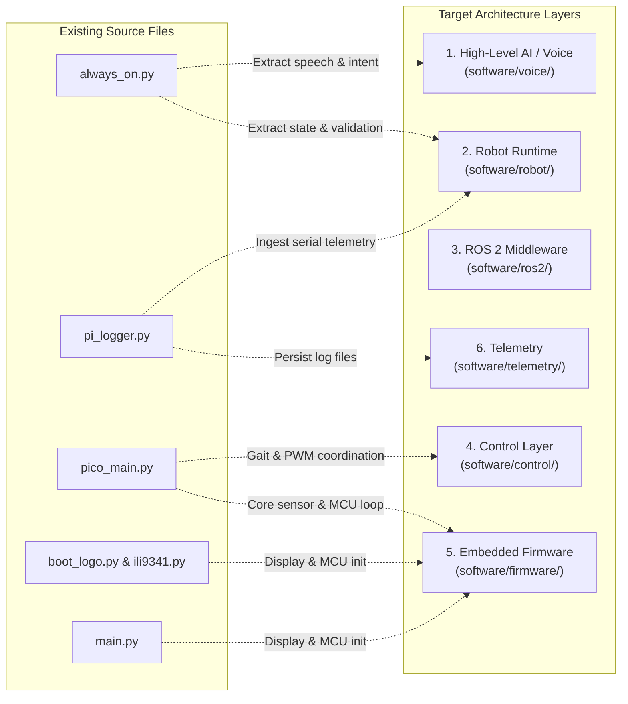

# Sipher Architecture & Codebase Inspection Report

**Date:** 2026-09-19  
**Target Specification:** [`docs/ARCHITECTURE.md`](../ARCHITECTURE.md) (Branch: `architecture/robot-platform`)  
**Scope:** Repository-wide audit, file-to-layer mapping, dependency analysis, and risk assessment.  
**Purpose:** Serves as the foundational baseline document for restructuring and migrating the Sipher robot software stack.

---

## 1. Executive Summary

Sipher is transitioning from an early monolithic prototype (direct Python scripts invoking MicroPython commands over ad-hoc serial) to a layered, robust robotics platform. 

The target architecture defined in [`docs/ARCHITECTURE.md`](../ARCHITECTURE.md) establishes a strict separation of concerns:
```
AI / Voice / Dashboard  -->  Robot Runtime  -->  ROS 2 Middleware  -->  Control Layer  -->  Pico 2 W Firmware  -->  Hardware
```

### Current Status
* Initial layer scaffolding (`software/control/`, `software/robot/`, `software/ros2/`) has been created on branch `architecture/robot-platform`.
* The running codebase remains coupled: high-level voice scripts bypass runtime validation, ROS 2, and the control layer to directly inject raw commands into the microcontroller over `/dev/ttyACM0`.
* The physical hardware (Pi 4, USB audio, Pico 2 W, MPU6050, 2.4" TFT display, nRF24L01, GPS) is fully verified and operational, providing a solid foundation for layer migration.

---

## 2. Repository Inventory & Branch State

| File / Component | Branch / Location | Purpose |
| :--- | :--- | :--- |
| `README.md` | `main` | Initial concept, quadruped draft layout, 12-DOF kinematics ideas. |
| `docs/ARCHITECTURE.md` | `architecture/robot-platform` | Official boundary contracts, layer responsibilities, safety rules. |
| `docs/hardware/pico-wiring.md` | `main` | Complete schematic pin map (I2C1, shared SPI0 for TFT/nRF, UART0). |
| `docs/hardware/pico-circuit.png` | `main` | Hardware circuit visualization. |
| `docs/pi-setup.md` | `main` | Pi 4 network, audio, and tool configuration. |
| `software/firmware/main.py` | Local / Pico Flash | Boot sequence: triggers boot logo display, delays, loads `pico_main`. |
| `software/firmware/boot_logo.py` | Local / Pico Flash | Loads `anime.rgb565` and blits image to ILI9341 display via SPI0. |
| `software/firmware/ili9341.py` | Local / Pico Flash | MicroPython driver for 240x320 TFT display. |
| `software/firmware/pico_main.py` | `main` / Pico Flash | Sensor polling (MPU, GPS, VL53, INA219) & streaming JSON telemetry. |
| `software/voice/always_on.py` | `main` | Continuous voice listener (Faster-Whisper / Groq / espeak) and direct servo trigger. |
| `software/telemetry/pi_logger.py` | `main` | Reads `/dev/ttyACM0` serial stream and logs to `/home/sipher/sipher.log`. |
| `software/control/README.md` | `architecture/robot-platform` | Contract for gait generation, joint limits, kinematic execution. |
| `software/robot/README.md` | `architecture/robot-platform` | Contract for state management, command validation, safety coordination. |
| `software/ros2/README.md` | `architecture/robot-platform` | Contract for ROS 2 nodes, topics, sensor publishers. |

---

## 3. Mapping Existing Files to Target Architecture Layers



### Detailed Mapping Table

| Existing File | Current Responsibilities | Target Layer Destination | Planned Refactoring |
| :--- | :--- | :--- | :--- |
| **`software/voice/always_on.py`** | Audio capture, Whisper STT, TTS, intent matching, direct command invocation (`mpremote run /tmp/all_now.py`, raw I2C memory writes, `shutdown`). | **Split across Layer 1 (Voice) & Layer 2 (Runtime)** | • **Voice Layer (`software/voice/`):** Responsible *only* for audio capture, STT, intent extraction, and emitting structured action requests (e.g. `REQUEST_MOTION(rotate)`).<br>• **Runtime Layer (`software/robot/`):** Receives the request, validates robot safety state, and publishes to ROS 2. Must completely remove all `mpremote` and `subprocess` motor execution calls from voice code. |
| **`software/telemetry/pi_logger.py`** | Direct serial reading of `/dev/ttyACM0` and appending to `/home/sipher/sipher.log`. | **Layer 2 (`software/robot/`) & Layer 6 (`software/telemetry/`)** | • The raw serial connection to `/dev/ttyACM0` belongs strictly in **Robot Runtime** (`software/robot/hardware_bridge.py`).<br>• Runtime publishes parsed sensor packets to ROS 2 topics (`/sensor/imu`, `/sensor/gps`, `/sensor/power`).<br>• `pi_logger.py` becomes a ROS 2 subscriber node or telemetry consumer rather than owning the serial port. |
| **`software/firmware/pico_main.py`** | I2C setup, MPU6050 read, PCA9685 init, GPS UART read, JSON serial streaming. | **Layer 5 (`software/firmware/`) & Layer 4 (`software/control/`)** | • **Firmware (`software/firmware/`):** Retains real-time sensor polling, serial packet transport, and hardware PWM generation.<br>• **Control (`software/control/`):** Inverse Kinematics, gait generation curves, and joint safety limits should be structured here (either executing compiled on MCU or calculated deterministically in the Pi control loop). |
| **`software/firmware/ili9341.py` & `boot_logo.py`** | SPI0 driver, image decoding, display framebuffer updates. | **Layer 5 (`software/firmware/`)** | • Belongs permanently in embedded firmware.<br>• Requires an interface hook so the Robot Runtime layer can command screen expressions (e.g., eyes, status, error codes) without interrupting SPI communication with the nRF24L01. |
| **`software/firmware/main.py`** | MicroPython startup coordinator. | **Layer 5 (`software/firmware/`)** | • Firmware entry point. Add safety watchdog/heartbeat initialization on boot. |

---

## 4. Architectural Boundary Violations

When evaluating the codebase against the rules in [`docs/ARCHITECTURE.md`](../ARCHITECTURE.md), the following violations are present:

1. **Direct AI/Voice-to-Motor Actuation:**
   * *Rule:* *"AI systems must not directly write servo PWM values, bypass safety limits, directly access motor drivers, or override emergency-stop logic."*
   * *Violation:* Lines 46 and 51 of `always_on.py` directly trigger external scripts (`mpremote connect ... run /tmp/all_now.py`) and inject raw I2C memory writes (`i2c.writeto_mem(0x40, 0x00, bytes([16]))`) to shut off the PCA9685 driver.
2. **Serial Port Contention (No Multiplexing):**
   * Both `pi_logger.py` and `always_on.py` attempt to access `/dev/ttyACM0` independently. If `pi_logger.py` holds the serial port open, any `mpremote` invocation from `always_on.py` crashes with `Device or resource busy`.
3. **Bypassing the ROS 2 & Control Pipeline:**
   * Motion commands completely skip kinematic calculations, posture stability checks (MPU6050), and obstacle clearance (VL53L0X).
4. **Missing Hardware Emergency-Stop (E-Stop) & Watchdog:**
   * If the Pi disconnects, crashes, or reboots while the robot is in motion, the Pico 2 W has no watchdog timer to automatically neutralize the PCA9685 servos.

---

## 5. Risk Assessment

```text
+-------------------------------------------------------------------------------+
| RISK MATRIX                                                                   |
+--------------------------+-------------------+----------------+---------------+
| Risk Description         | Impact            | Likelihood     | Severity      |
+--------------------------+-------------------+----------------+---------------+
| Mechanical / Over-travel | High (Servo strip)| High           | CRITICAL      |
| Serial Port Lockup       | High (Loss of CTL)| High           | CRITICAL      |
| Watchdog / Runaway       | High (Crash/Fall) | Medium         | HIGH          |
| Shared SPI0 Bus Collision| Medium (Display/RF| Medium         | MEDIUM        |
| Battery Brownout         | High (Pi reboot)  | Medium         | HIGH          |
+--------------------------+-------------------+----------------+---------------+
```

### Risk Details

1. **Mechanical Damage from Unvalidated Joint Angles (Critical):**
   * Without the **Control Layer** enforcing angle boundaries (e.g. $[0^\circ, 180^\circ]$ or mechanical joint stops), any corrupted serial command or erratic gait calculation will over-rotate servos, stripping plastic/metal gears and drawing stall current.
2. **Serial Contention & Communication Blackout (Critical):**
   * Multiple uncoordinated scripts opening `/dev/ttyACM0` causes intermittent lockouts. A single broker process must own the serial file descriptor.
3. **Loss of Heartbeat / Physical Runaway (High):**
   * If a gait routine is executing and the Pi or serial cable disconnects, the robot will continue walking blind. The Pico firmware must enforce a 250 ms communication timeout that drops all servo PWM to idle if no keep-alive packet is received.
4. **Shared SPI0 Bus Contention on Pico 2 W (Medium):**
   * The 2.4" TFT and nRF24L01 share `GP18` (SCK), `GP19` (MOSI), and `GP16` (MISO). Writing a 240×320 screen buffer takes tens of milliseconds over SPI. If nRF RF packets arrive while the display transfer is in progress, packets will be dropped unless SPI transfers are chunked or handled with careful chip-select scheduling.
5. **Electrical / Power Rail Instability (High):**
   * 12 servos moving simultaneously can draw $>4\text{A}$ transient current spikes. If the battery voltage dips below the UBEC threshold, the Pi or Pico will brown out. The INA219 current monitoring code is currently dormant (`"ina": None`).

---

## 6. Dependencies & Prerequisites

### System & Middleware Dependencies
* **Operating System:** Ubuntu 24.04.4 LTS (`noble`) on Raspberry Pi 4 (ARM64).
* **ROS 2:** **ROS 2 Jazzy Jalisco** (official LTS release for Ubuntu 24.04 `noble`).
  * Required packages: `rclpy`, `std_msgs`, `geometry_msgs`, `sensor_msgs`, `robot_state_publisher`.
* **MicroPython Tools:** `mpremote` (v1.29.0) or a dedicated Python serial bridge daemon using `pyserial`.

### Hardware Bus Dependencies
* **I2C1 (Fast mode 100 kHz):** MPU6050 (`0x68`), PCA9685 (`0x40`), INA219 (`0x41`), VL53L0X (`0x29`).
* **SPI0 (Dual CS):** TFT ILI9341 (`CS: GP17`) + nRF24L01 (`CSN: GP20`).
* **UART0 (9600 baud):** NEO-6M GPS.

---

## 7. Migration Roadmap

Following the migration principle:  
$$\text{Inspect} \longrightarrow \text{Map} \longrightarrow \text{Define Destination} \longrightarrow \text{Migrate} \longrightarrow \text{Validate} \longrightarrow \text{Commit}$$

```text
Phase 1: Serial Hardware Bridge (Runtime Layer)
  ├── Build software/robot/pico_bridge.py
  ├── Single-owner access to /dev/ttyACM0
  └── Emits clean parsed JSON telemetry and receives validated movement commands

Phase 2: Control Layer & Safety Envelope (Control Layer)
  ├── Implement software/control/joint_limits.py (min/max angles, rate limits)
  ├── Implement software/control/emergency_stop.py (software + hardware E-Stop)
  └── Implement firmware watchdog on Pico (250 ms timeout auto-neutralize)

Phase 3: ROS 2 Integration (ROS 2 Layer)
  ├── Create sipher_hardware ROS 2 package
  ├── Publish /imu/data, /gps/fix, /battery/status
  └── Subscribe to /cmd_vel (geometry_msgs/Twist)

Phase 4: Decouple Voice & AI (Voice Layer)
  ├── Refactor software/voice/always_on.py to publish high-level goals
  └── Route motion intents through the Runtime validator
```
